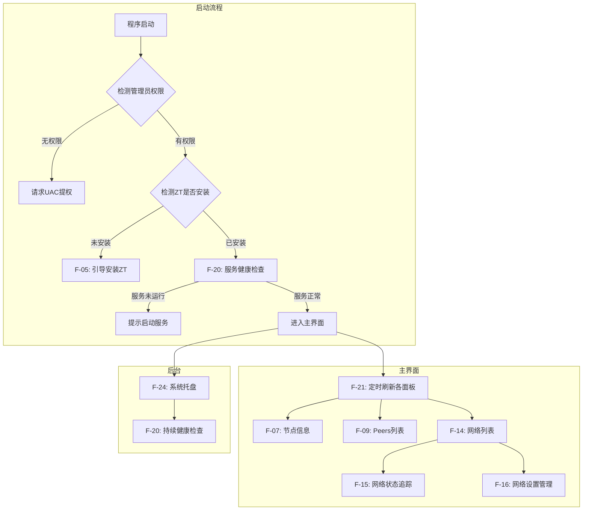

# ZeroTier GUI 功能清单

> **基线版本**: v1.0  
> **当前阶段**: Phase 1 — 网络管理  
> **目标用户**: 个人日常使用  
> **平台**: Windows  
> **最后更新**: 2026-05-31

---

## ⚠️ 关于参考项目

当前工作区中的 `main.cpp`、`MainWindow.*`、`tabs/` 等文件为**参考实现**，仅用于理解 ZeroTier CLI 的调用方式和 Qt6 的基础用法。本文档描述的是 **Phase 1 目标系统的功能需求**，不假定现有代码结构会被保留。实现时允许（且鼓励）对现有代码进行任意程度的重构甚至推倒重来，只要最终满足本文档定义的各项功能即可。

---

## 一、阶段划分

本项目采用分阶段开发策略，各阶段通过**新增标签页**的方式扩展功能：

| 阶段 | 标签页范围 | 说明 |
|------|-----------|------|
| **Phase 1（当前）** | Service / Info / Peers / Networks / Moon | 核心网络管理功能 |
| **Phase 2（远期）** | + Chat | 基于 ZT 虚拟局域网的文字聊天 |
| **Phase 3（远期）** | + Voice | 基于 ZT 虚拟局域网的语音通话 |
| **Phase 4（远期）** | + Files | 基于 ZT 虚拟局域网的文件传输与管理 |
| **Phase N（远期）** | 待定 | 其他协作/共享功能 |

> **重要**: 当前 Phase 1 **仅聚焦网络管理功能**。Phase 2+ 的功能仅作为架构前瞻参考，不纳入当前设计、编码和交付范围。

---

## 二、Phase 1 功能需求（网络管理）

### 2.1 服务管理

| 编号 | 功能 | 详细描述 | 优先级 |
|------|------|---------|--------|
| F-01 | 服务启动 | 以管理员权限启动 `ZeroTierOneService`，显示执行结果 | P0 |
| F-02 | 服务停止 | 以管理员权限停止 `ZeroTierOneService`，可忽略系统错误 109 | P0 |
| F-03 | 服务重启 | 先停止再启动，实现重启效果 | P0 |
| F-04 | 服务状态指示 | 界面实时显示当前服务运行状态（运行中/已停止/未知） | P1 |
| F-05 | 一键安装 ZT | 通过 GUI 下载 ZeroTier MSI 安装包并静默安装，显示下载进度；安装完成后提示可将服务设为手动启动 (`sc config`) | P0 |
| F-06 | 一键卸载 ZT | 调用 `winget uninstall "ZeroTier One"`，自动处理协议确认提示 | P0 |

### 2.2 节点信息

| 编号 | 功能 | 详细描述 | 优先级 |
|------|------|---------|--------|
| F-07 | 节点信息展示 | 调用 `zerotier-cli -j info`，以结构化视图展示关键字段：address、version、online、homeDir、primaryPort、listeningOn、publicIdentity 等 | P0 |
| F-08 | 端口占用检测 | 检测 9993 端口是否被其他程序占用，若占用则提示用户并显示占用进程名称 | P1 |

### 2.3 Peers 管理

| 编号 | 功能 | 详细描述 | 优先级 |
|------|------|---------|--------|
| F-09 | Peers 列表 | 调用 `zerotier-cli -j listpeers`，以表格展示所有 peers（地址、角色 PLANET/MOON/LEAF、延迟、连接方式 DIRECT/RELAY、物理地址） | P0 |
| F-10 | Peers 过滤排序 | 支持按角色、延迟、连接状态过滤和排序 | P2 |
| F-11 | Peers 缓存清理 | 一键清理 `%homeDir%\peers.d` 下的过期缓存文件 | P1 |

### 2.4 网络管理

| 编号 | 功能 | 详细描述 | 优先级 |
|------|------|---------|--------|
| F-12 | 加入网络 | 输入 16 位网络 ID，调用 `zerotier-cli join <nwid>` | P0 |
| F-13 | 离开网络 | 输入或选择网络 ID，调用 `zerotier-cli leave <nwid>` | P0 |
| F-14 | 网络列表 | 调用 `zerotier-cli -j listnetworks`，表格展示（nwid、名称、状态、类型、分配 IP） | P0 |
| F-15 | 网络状态追踪 | join 后自动轮询 `listnetworks`，追踪状态变化：OK（绿色）、ACCESS_DENIED（黄色，等待认证）、NOT_FOUND（红色，自动 leave） | P0 |
| F-16 | 网络设置管理 | 对已加入网络执行 `get`/`set` 操作，支持常用属性：allowDNS、allowDefault、allowGlobal、allowManaged、bridge、broadcastEnabled、mtu 等 | P1 |
| F-17 | 网络详情面板 | 选中某网络后展示完整 JSON 详情（路由、DNS、多播订阅、端口设备等） | P2 |

### 2.5 Moon 管理

| 编号 | 功能 | 详细描述 | 优先级 |
|------|------|---------|--------|
| F-18 | Moon 文件导入 | 选择 .moon 文件，自动复制到 `%homeDir%\moon.d\`，完成后自动重启服务 | P0 |
| F-19 | Moon 列表 | 读取 `%homeDir%\moon.d\` 目录，列出所有已安装的 moon 节点文件 | P0 |

### 2.6 系统监控与自动化

| 编号 | 功能 | 详细描述 | 优先级 |
|------|------|---------|--------|
| F-20 | 服务健康检查 | 启动时自动检测 ZT 服务是否运行，若未运行则提示启动；运行中定时检查在线状态 | P1 |
| F-21 | 定时自动刷新 | 各标签页支持可配置的定时轮询（默认 5-10 秒），自动更新显示数据 | P1 |
| F-22 | Debug 信息导出 | 执行 `zerotier-cli dump` 并将输出保存为文件 | P2 |
| F-23 | 日志查看器 | 读取并展示 ZT 服务日志（`%homeDir%\zerotier-one.log` 或 Windows 事件日志） | P2 |

### 2.7 用户体验

| 编号 | 功能 | 详细描述 | 优先级 |
|------|------|---------|--------|
| F-24 | 系统托盘 | 最小化到系统托盘；托盘图标反映在线/离线状态；右键菜单提供快速操作（启动/停止服务、显示窗口、退出）；支持气泡通知 | P0 |
| F-25 | 全局状态栏 | 主窗口底部状态栏实时显示：ZT 版本号、在线状态、已加入网络数、peers 数 | P2 |
| F-26 | 管理员权限 | 启动时自动检测并以 UAC 提权运行（ZT 服务管理必须管理员权限） | P0 |
| F-27 | 深色/浅色主题 | 支持明暗主题切换，默认跟随系统 | P3 |

---

## 三、功能优先级定义

| 优先级 | 含义 | 说明 |
|--------|------|------|
| **P0** | 必须实现 | 核心功能，第一版必须交付 |
| **P1** | 应该实现 | 重要功能，显著提升日常使用体验 |
| **P2** | 可以实现 | 锦上添花，视开发时间决定 |
| **P3** | 未来考虑 | 当前 Phase 1 可暂缓 |

---

## 四、功能交互关系

---

## 五、远期路线图（Phase 2+，不纳入当前交付）

以下功能属于远期规划，**不在 Phase 1 范围内**，仅作为架构前瞻参考：

### 5.1 文字聊天（Phase 2）

| 编号 | 功能描述 | 备注 |
|------|---------|------|
| F-28 | 基于 ZT 虚拟 IP 的点对点文字聊天 | TCP 直连，无需中心服务器 |
| F-29 | 群组广播消息 | 向同一 ZT 网段内所有节点发送 |
| F-30 | 聊天记录本地存储 | SQLite 或纯文本日志 |

### 5.2 语音通话（Phase 3）

| 编号 | 功能描述 | 备注 |
|------|---------|------|
| F-31 | 基于 ZT 虚拟 IP 的点对点语音通话 | 可考虑 Qt Multimedia 或第三方音频库 |
| F-32 | 多人语音会议 | 需要混音/转发逻辑 |

### 5.3 文件管理（Phase 4）

| 编号 | 功能描述 | 备注 |
|------|---------|------|
| F-33 | 基于 ZT 虚拟局域网的点对点文件传输 | TCP 直连传输 |
| F-34 | 共享文件夹管理 | 类似局域网共享目录 |
| F-35 | 传输进度与断点续传 | 大文件场景 |

### 5.4 明确排除的功能

| 功能 | 排除原因 |
|------|---------|
| Moon 节点生成 | 用户未选择；日常场景较少需要 |
| 批量网络操作 | 日常使用通常只管理少量网络 |
| 跨平台支持 | 用户明确仅需 Windows |
| 远程管理 | 超出个人日常使用范围 |
| 网络流量图表 | 实现复杂度高，日常需求不强 |
| 聊天/语音/文件 | 属于 Phase 2+，不在当前交付范围 |
